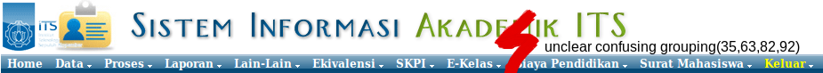
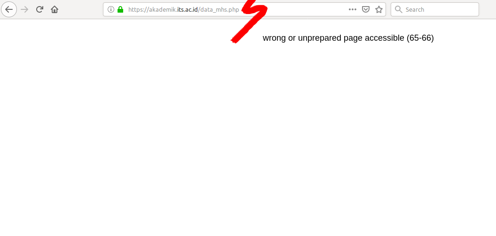
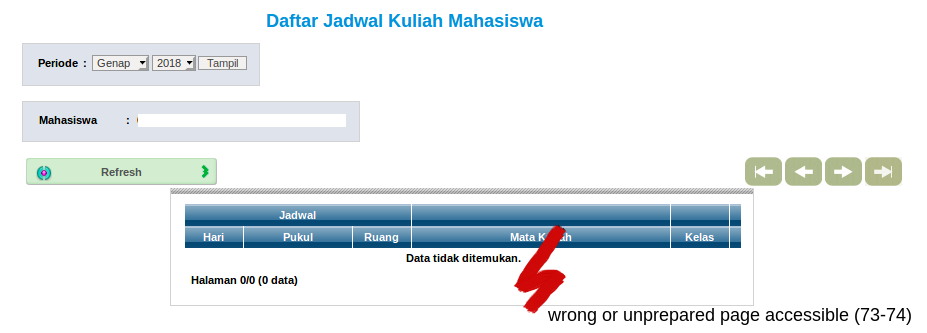
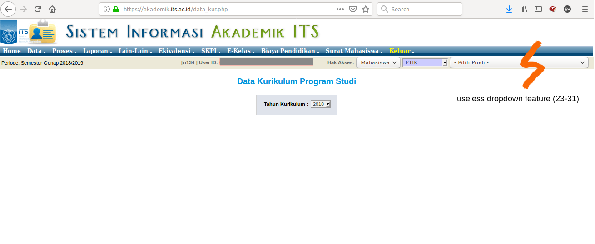
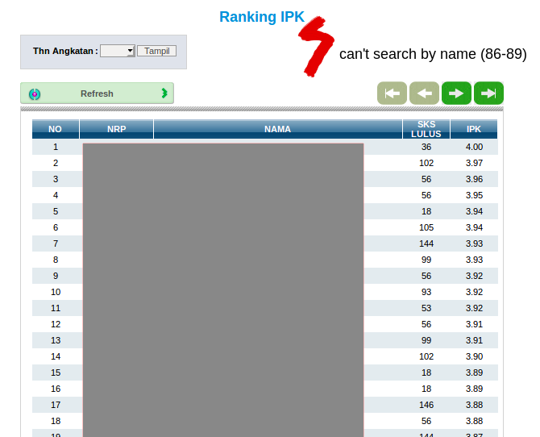
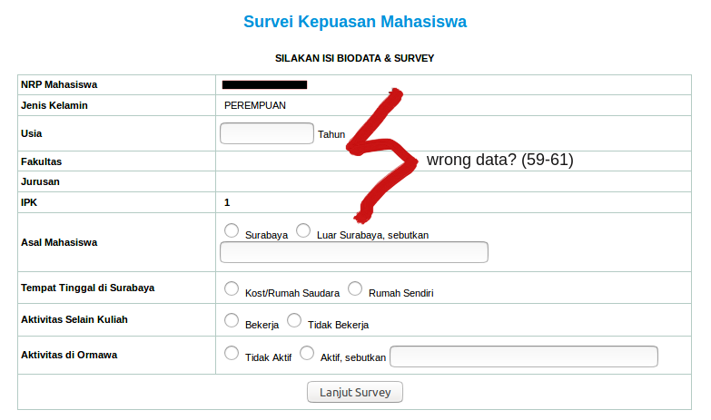
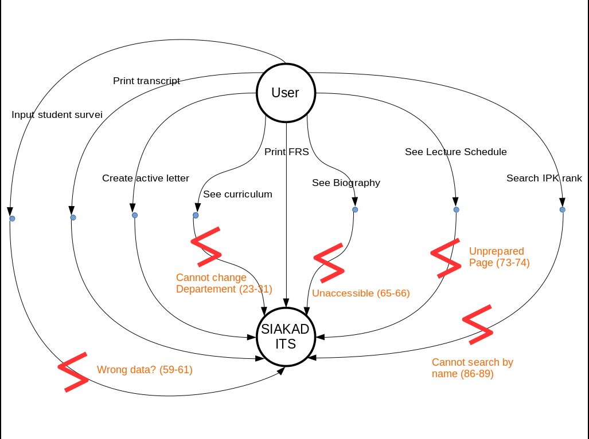
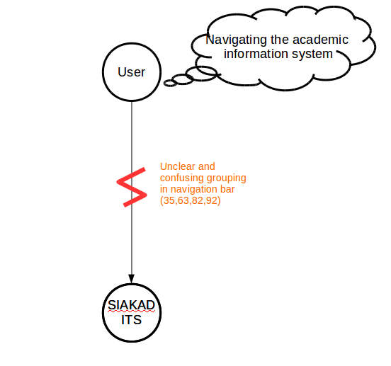

# Contextual Inquiry and Analysis
## Device/ App/ Website Description

Institut Teknologi Sepuluh Nopember Academic Information System Website. Integrated with Integra ITS, ITS Information System on integra.its.ac.id

## Instruction Script

1. Open akademik.its.ac.id and login with student account
2. Open FRS, and print it
3. Open Semester Curriculum 
4. Open Study Transcript and print it
5. Try creating an active student letter
6. Try inputting Student comfortness survey
7. Open Student biography page
8. See Lecture schedule
9. Search your rank of IPK
10. Logout

## User Description

Male
18 years old
2nd semester 
D3 Instrumentation Engineering Student
often accessing SIAKAD

## Transcript

1. A : udah pernah buka SIAKAD ITS?
2. B : pernah
3. A : sering gak?
4. B : sering
5. A : yaudah deh, coba dibuka
6. B : (buka integra.its.ac.id, login, pilih SIAKAD, masuk home)
7. A : belum pernah ambil matkul ya?
8. B : belum
9. A : masih paketan ya
10. B : iya
11. A : yaudah coba buka FRS
12. B : (scroll ke bawah di home, memilih Formulir Rencana Studi)
13. A : coba di cetak
14. B : (menge-klik tombol KRSM versi cetak)
15. B : (menekan ok di modal pemberitahuan)
16. B : (menekan _ctrl + p_ di keyboard)
17. B : (memilih save as pdf)
18. A : oke, lancar ya
19. A : sekarang coba liat kurikulum
20. B : (menutup jendela KRSM versi cetak, memncari _kurikulum semester_ pada navbar, dan menekannya)
21. A : itu kuikulum jurusanmu ya
22. B : iya
23. A : coba liat kurikulum jurusan lain bisa ga?
24. B : kayaknya sih gabisa
25. A : pernah merhatiin dropdown dikanan atas gak?
26. B : ini? (menunujuk dropdown jurusan dan fakultas pada kanan atas dengan mouse)
27. A : bisa di ganti ga?
28. B : gabisa
29. A : berarti gunanya buat apa ya?
30. B : gatau (mencoba memilih _-pilih prodi-_ pada dropdown)
31. (halaman me-refresh, daftar kurikulumnya hilang)
32. A : yaudah balik lagi aja
33. B : (menekan tombol _home_ pada navbar)
34. A : sekarang coba print transkrip
35. B : (mencari transkrip di navbar, cukup lama)
36. B : (menekan print transkrip di tab laporan -> transkrip -> transkrip)
37. B : (menekan lihat transkrip)
38. B : (menekan _ctrl + p_ di keyboard)
39. B : (memilih save as pdf)
40. A : oke, back lagi.
41. A : tadi cetaknya bentuk pdf ya?
42. B : iya
43. A : coba ganti cetak transkrip formatnya excel
44. B : (mengganti format di halaman transkrip, menekan _lihat transkrip_)
45. (muncul notifikasi download file excel)
45. A : langsung download ya? gmpang berarti
46. A : yaudah sekarang coba bikin pengajuan surat keterangan mahasiswa aktif
47. B : (dengan cepat menekan tab _Surat Mahasiswa -> layanan surat mahasiswa_)
48. B : (memilih SKTM)
49.  ( muncul form pengajuan dan historis pengjuan)
50. A : udah pernah buat lewat sini ya?
51. B : iya pernah.
52. A : itu bisa langsung dicetak?
53. B : harus nunggu disetujui dulu
54. A : oke, sekarang coba input survei
55. B : survei?
56. A : survei kepusasan mahasiswa, cari aja
57. B : oh ini (menekan _lain-lain -> survei kepuasan mahsiswa_)
58. (halaman survei terbuka, tertulis jenis kelamin perempuan)
59. B : kok perempuan? wkkwwk
60. A : wkwkwk sama kok, di punyaku juga begitu. sesat ini wkwk
61. B : wkwkwkw
62. A : yaudah balik lagi, coba lihat biodata mahasiswa
63. B : (kesulitan mencari di navbar, akhirnya pergi ke home)
64. A : (scrolldown, menekan _biodata mahasiswa_)
65. (muncul halaman kosong ...)
66. A : ini gaada atau gabisa diakses ya,
67. B : menekan tombol back pada browser
68. A : sekarang coba liat jadwal perkuliahan
69. B : (tidak menemukan di navbar)
70. B : (membuka halaman home, menekan daftar perkuliahan mahasiswa)
71. (muncul halaman _Mata Kuliah Mahasiswa_, tidak ada daftarnya)
72. itu daftar, coba cari jadwal
73. B : (back, memilih _Jadwal perkuliahan_)
74. (muncul halaman jadwal, kosong)
75. A : itu pilihan semesternya sudah benar semester ini kan?
76. (terdapat dropdown berisi _genap_ dan _2018_)
77. B : iya, sudah benar
78. A : yaudah back, back
79. A : terakhir coba lihat ranking IPK
80. B : IPK?
81. A : iya
82. (melihat dropdown _laporan -> nilai_, berisi _nilai per mhs, nilai persemester, ranking IPK, ranking IPS_)
83. B : lihat IPK-nya atau? 
84. A : ranking IPK
85. (muncul ranking IPK)
86. A : bisa nyari dari nama gak?
87. B : gabisa, paling filter angkatan aja
88. A : oke, susah berarti kalau mau nyari ya
89. B : iya
90. A : nah, coba balik ke home
91. A : menurutmu lebih mudah cari modul di navbar atau list yang ada di home
92. B : yang dari sini sih (nenunjuk list pada home)
93. A : oke, yaudah makasih banyak ya

A = Me
B = User

## Models and Annotations
### Artifact Model

### Flow Model

### Cultural Model

## Do's and Don't's

###Do's:
- Rearrange navigation bar grouping in easier way
- Remove unneeded features
- Add search by name in IPK ranking

###Don't's:
- Give access to unavailable data
- Show wrong data